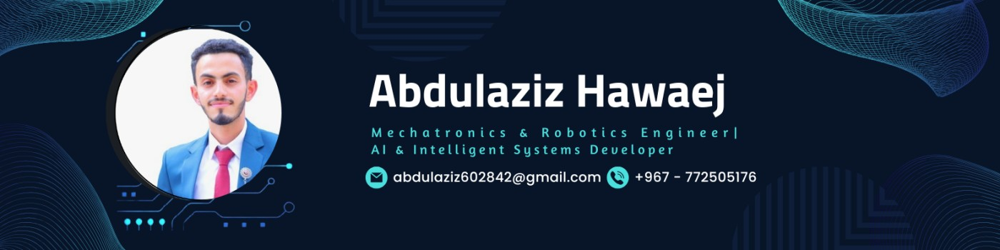

<!-- 

  

 -->

<h1 align="center">Hi 👋, I'm Abdulaziz Ahmed Hawaej</h1>
<h3 align="center">Mechatronics & Robotics Engineer | AI/ML Engineering Enthusiast | Data Science Practitioner</h3>

  

### 🎯 About Me

Mechatronics Engineering graduate with extensive programming expertise in **Python, C/C++, and Rust**. Nearly **3 years of hands-on experience** in AI/ML applications, Intelligent Systems, and Industrial Automation. Currently working as an AI/ML Engineer at DeepSafer, responsible for the complete ML lifecycle—from research and data engineering to model training, evaluation, and deployment for IT security services including anomaly detection and malware analysis. Passionate about bridging hardware intelligence with cutting-edge AI solutions for Industry 4.0 and cybersecurity.

- 🔭 **Currently working on:** End-to-end ML/DL model lifecycle for Anomaly Detection and Windows-PE Malware Detection at DeepSafer
- 🌱 **Currently learning:** AI Agents, LLMs, Agentic AI Development, Advanced MLOps practices
- 👯 **Looking to collaborate on:** AI/ML projects in Computer Vision, NLP, Reinforcement Learning, Intelligent Systems, and Cybersecurity
- 💡 **Core Expertise:** AI Programming, Data Engineering, Model Deployment, Automation, Engineering Design Thinking
- 📫 **Reach me at:** abdulaziz602842@gmail.com
- 📍 **Location:** Yemen
- 💼 **LinkedIn:** [Abdulaziz Ahmed Hawaej](https://www.linkedin.com/in/abdulaziz-ahmed-hawaej-a670161b1)
- 🌐 **Portfolio:** [github.com/Azzoz-189](https://www.github.com/Azzoz-189)

---

### 🏆 Education

**Bachelor of Engineering in Mechatronics** | Sana'a University, Yemen (2018 - 2023)
- GPA: 76.64%
- **Focus:** Mechatronic Engineering, Robotics and Artificial Intelligence
- **Key Coursework:** Computer Science Principles, Applied Math and Calculus, Mechatronic Systems Design, AI Principles & Algorithms, Robotics Principles, Engineering Project Management, Industrial & Occupational Safety Practices

---

### 💼 Professional Experience

**AI/ML Engineer** | DeepSafer for Digital Solutions & AI, Sanaa, Yemen (July 2024 - Present)
- Building and preparing AI/ML models for IT security services including anomaly detection and Windows-PE malicious apps/files
- Managing complete ML lifecycle: research, data collection, engineering, preparation, model training, evaluation, and deployment
- Deploying models on IT Infrastructure with optimized performance using ONNX & Hummingbird-ml
- Optimizing machine learning model performance with hyperparameter tuning techniques
- Achieving improved accuracy and generalization capabilities in production environments

**AI/ML Teaching Assistant** | Digital Science University (DSU), Sana'a, Yemen (November 2025 - December 2025)
- Teaching Assistant in Artificial Intelligence and Machine Learning for Robotics & AI students (2 batches)
- Instructed students in Python programming fundamentals (syntax, functions, OOP, basic algorithms)
- Taught data analysis and preparation (NumPy, pandas, cleaning, handling missing values, visualization)
- Guided feature engineering principles (scaling, encoding, feature selection, transformation)
- Mentored ML model development and evaluation (classification, regression, train/validation/test splits, metrics)
- Applied AI/ML theory to robotics-related projects connecting theory with real-world intelligent systems

**Machine Learning Engineer** | Amazon Web Services (AWS), Remote (June 2023 - March 2025)
- Developed and deployed ML models using AWS services (SageMaker, S3, Lambda Functions)
- Applied reinforcement learning techniques for autonomous systems optimization

**AI Developer** | Creative Point for Digital Solutions & AI, Sana'a, Yemen (May 2024 - July 2024)
- Developed AI solutions and applications for digital transformation projects

**Virtual Reinforcement Learning Engineering Competitor** | AWS-Amazon Web Services (June 2023 - October 2023)
- **🏆 Achievement:** Won 3rd Yemeni Ranking, Top 10% Middle-East Ranking
- Trained Reinforcement Learning agents for autonomous racing car applications using Python
- Engineered agent parameters (speed, velocity, distance, steering-angle) with optimized reward functions
- Manipulated hyperparameters of RL models with OpenVino-micro-processor, LiDAR, ultrasonic, accelerometer, and encoder systems

**Mechatronics Technician (Intern)** | Arwa Mineral Water Co., Sana'a, Yemen (March 2023 - April 2023)
- Applied electrical and mechanical maintenance across factory facilities: Production Lines, Control Panels, Quality Control Lab, Power Plants, and Workshops
- Performed PLC troubleshooting and configuration, Control Panels building and wiring
- Gained hands-on experience in industrial automation and production line optimization

---

### 🚀 AI/ML & Engineering Projects

**Arabic Hand-Written OCR** | Computer Vision & Deep Learning
- Researching and applying AI techniques using Computer Vision for Arabic Handwritten OCR detection
- Implementing solutions with Python using Jupyter-Notebook for model development and testing

**Pretrained Image Classifier Model** | Transfer Learning & Classification
- Building and programming a Pretrained Image Classifier for dog detection and breed classification
- Utilizing Python, Jupyter Notebook platform, and CLI for model deployment and inference

**Topic Analysis of Clothing Reviews with Embeddings** | NLP & Sentiment Analysis
- Using text embeddings with ChromaDB, OpenAI API, and Python for customer review analysis
- Uncovering underlying themes and understanding customer sentiments through vector database queries
- Implemented in Jupyter-Notebook within Anaconda environments for sentiment analysis and classifications

**Recycling Plastics into Synthetic Fabrics/Wool (RPSF)** | Mechatronics & Project Leadership
- Led a team to research, design, and prototype a PET plastic recycling machine (Graduation Project)
- Applied CAD designs, control algorithms, microcontrollers, and Engineering Project Management principles
- Successfully delivered the project with full grade results as team leader

---

### 🛠️ Technical Skills

**Programming Languages:**

  
  
  
  
  

**AI/ML & Deep Learning:**

  
  
  
  
  
  

**AI Agents & LLMs:**

  
  

**Data Science & Analytics:**
- Data Analytics & EDA (Exploratory Data Analysis)
- Python OOP & Data Structures
- Statistics & Applied Mathematics
- Vector Databases (ChromaDB)
- Jupyter Notebook & Anaconda

**Web Development & Frameworks:**

  
  

**DevOps & Cloud:**

  
  
  
  

**MLOps & Model Optimization:**
- ONNX (Open Neural Network Exchange)
- Hummingbird-ml for Model Optimization
- Model Quantization & Performance Tuning
- AWS SageMaker, S3, Lambda Functions
- Applications Containerization (Docker/Kubernetes)

**Industrial Automation & Hardware:**

  
  

**Development Tools:**
- Git Version Control & CLI
- Bash/Shell Scripting
- Linux Commands & Environment
- Web Scraping & Automation with Python
- MS Office Suite (Word, Excel, PPT)

**Specialized Competencies:**
- **AI/ML:** Neural Networks, Deep Learning, CNN, Computer Vision, NLP, LLMs, Generative AI
- **Agentic AI:** AI Agents Development, LangChain, OpenAI API Integration
- **MLOps:** Model Deployment, Optimization, Quantization, Containerization
- **Data Engineering:** EDA, Data Analytics, Vector Databases, Embeddings
- **Industrial Automation:** TIA Portal (Siemens PLC), Factory I/O, LabView, CAD/CAM-CNC
- **Control Systems:** PLC Programming, Sensor Calibration, VFD/PLC Safety Systems
- **Design & Simulation:** SolidWorks (CAD/CAM), MATLAB, Industrial Environment Simulation
- **Project Management:** Engineering Project Management, Design Thinking, Agile Methodologies

---

### 📜 Certifications & Courses

**AI/ML & Robotics Certifications:**
- **Modern Robotics, Course 1: Foundations of Robot Motion** - Northwestern University (April 2025)
- **AI Programming with Python Nanodegree** - Udacity (Oct 2023 - Jan 2024)
  - Python, Data Structures, NumPy, Pandas, Matplotlib, OOP, Neural Networks with PyTorch
- **AWS Machine Learning Fundamentals** - Udacity (September 2024)
- **AWS Machine Learning Engineer Nanodegree** - Udacity (May 2024 - Present)
  - ML algorithms, Deep Learning, CNN, AWS SageMaker, S3, Lambda Functions
- **AI Fundamentals** - DataCamp (Dec 2023 - Feb 2024)
  - AI, ML, LLMs, Generative AI, ChatGPT, AI Ethics
- **OpenAI Fundamentals** - DataCamp (Jan 2024 - Mar 2024)
  - OpenAI API integration for chatbots, semantic search, recommendation systems

**Professional Development:**
- **Using Python for Automation** - LinkedIn (April 2024)
- **Digital Manufacturing & Design** - University at Buffalo (SUNY) | Coursera (Feb 2023)
- **Introduction to Design Thinking and Product Development** - Udemy (Aug 2022)
- **Project Management** - Udemy (Aug 2022)

**IT & Cybersecurity:**
- **Wireless Network Security Certified Training** - Eskills Academy (Nov 2021)

**Web Development & Programming:**
- **Responsive Web Design** - Sololearn (Sep 2021)
- **Javascript Tutorial** - SoloLearn (Jul 2020)
- **HTML Fundamentals** - SoloLearn (Apr 2020)
- **CSS Fundamentals** - SoloLearn (May 2020)
- **C Tutorials** - SoloLearn (Apr 2020)

**Engineering Certifications:**
- **Industrial Automation Safety Basics** - Sana'a University (2023)
- **PLC Troubleshooting Essentials** - RealPars Platform (2022)
- **Industrial Sensors Fundamentals** - Sana'a University (2022)
- **Introduction to Industrial Networking** - RealPars Platform (2023)

**Language Proficiency:**
- **English Proficiency Certificate** - Duolingo English Test (Feb 2026)

---

### 📊 GitHub Stats

  
  

---

### 🌍 Languages

- **Arabic:** Native/Bilingual Proficiency (C2)
- **English:** Advanced Proficiency (C1)

---

### 💡 Interests & Focus Areas

- AI Systems & Intelligent Systems
- Data Science & Machine Learning Operations (MLOps)
- Robotics & Autonomous Systems
- IoT/IIoT & Embedded Systems
- AWS Cloud Services & Smart Manufacturing
- Industry 4.0 & Automation

---

### 🤝 Let's Connect

  
  

---

  <em>AI/ML Engineer & Mechatronics Professional | Building Intelligent Solutions for Industry 4.0 through AI, ML, and Automation</em>

